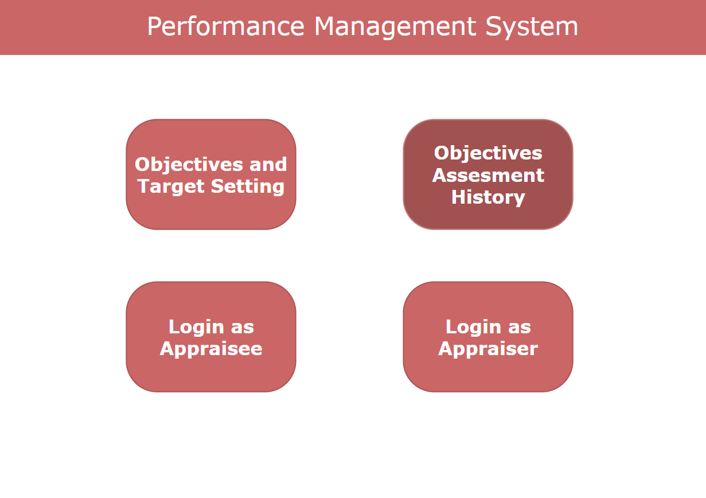
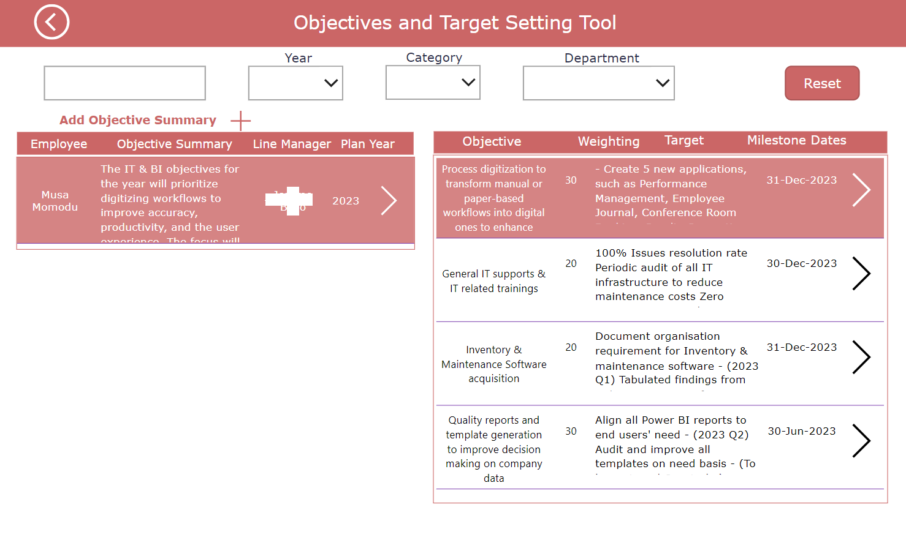
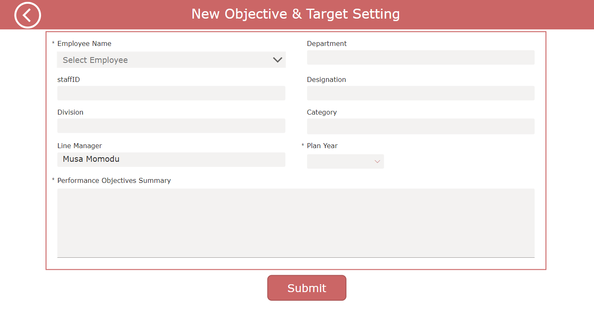
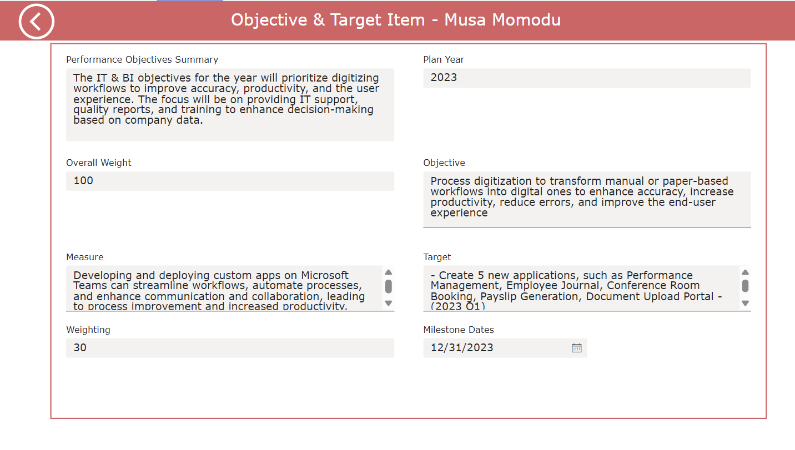
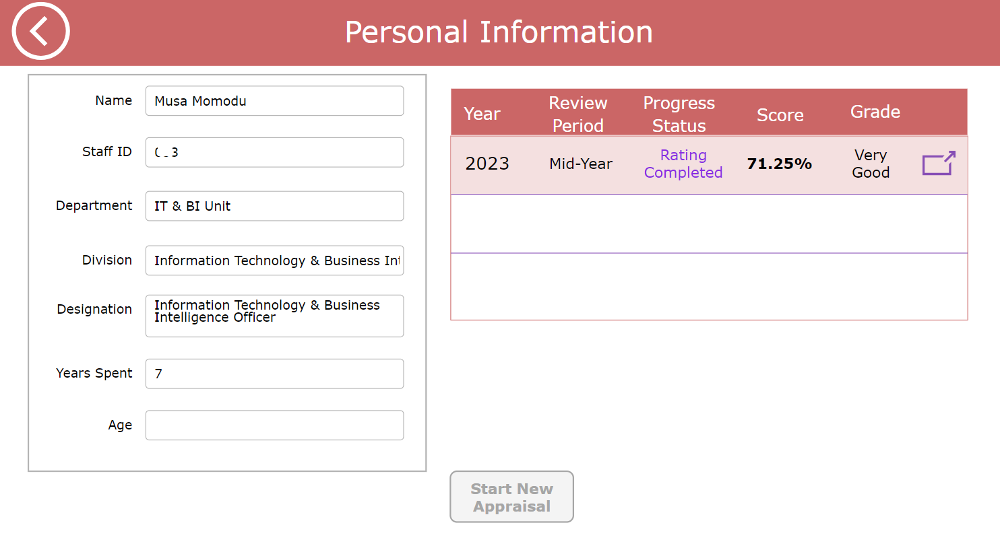

# Performance-Management-Application(PMA)

## 1. Introduction

### 1.1 Overview
The Performance Management App (PMA), is designed using Microsoft Power Platform tools to systematically monitor and evaluate employee performance within an organization. Its purpose is to ensure that employees meet established expectations in terms of performance, availability, and overall user experience. PMA provides a holistic view of an employee’s performance by tracking various dimensions. 
### 1.2 Key Features
- **Objective Settings**: Employees’ individual goals and targets are defined clearly. PMA monitors progress toward achieving these objectives.
- **Performance Appraisal**: Regular assessments are conducted to evaluate an employee’s performance against predefined criteria. This includes factors like productivity, quality of work, teamwork, and adherence to company policies.
- **Timely Notifications**: The system sends notifications to relevant parties (such as managers and employees) at various stages of the Appraisal,and Objective setting process, ensuring everyone stays informed.
- **360-Degree Reviews:**: PMA gathers feedback from peers, subordinates, and supervisors to provide a well-rounded assessment.
- **KPI Tracking**: Key Performance Indicators (KPIs) are monitored to gauge an employee’s effectiveness in their role.
- **Robust Security Protocols**: The application ensures data security and access control, safeguarding sensitive leave-related information.

# 2.0 Details
## 2.1 Skill Demonstrated
- Database:The application’s data structure relies on Microsoft Dataverse Tables for organizing data, establishing relationships, and connecting to the app.
Alternatively, SharePoint or SQL Server can serve the same purpose, but consistent field name maintenance is essential.
- PowerApps: We utilize PowerApps to design a customized user interface.
Its adaptable design features allow us to create intuitive and personalized experiences for end-users.
- Power Automate: Implemented to optimize and automate approval procedures within the application development framework.
It enhances workflow administration and promotes collaboration among team members.
- Power BI: Employed for crafting visual representations that provide deep insights and analytical perspectives.
These insights cover various aspects of documents, including usage patterns, access history, and performance metrics. 

### 2.2 User Roles and Controls
Three distinct roles have been delineated within the application: super admin, editor, and viewer.
- Super Admin: The super admin possesses extensive privileges, allowing them to create, update, read, and delete not only their own record but also all accessible records throughout the application.
- Editor: Editors can create, edit, and update their own records.
- Viewer: Viewers have limited access and can only browse records for which they have explicit permission.

## 3. App Interface

### 3.1 Main Page

### 3.2 Objective and goals Setting

#### 3.2.1 New Objective & Goals Setting

Objective Screen | Goal Screen
:------------------:|:---------------------:
   | 

### 3.3 Appraisal Home Screen

